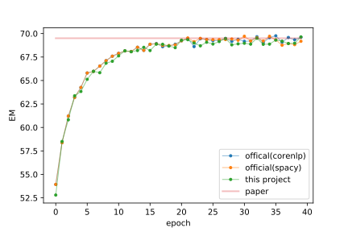
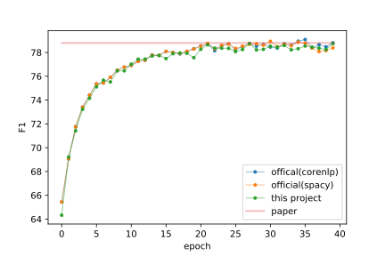

DrQA
---
A pytorch implementation of the ACL 2017 paper [Reading Wikipedia to Answer Open-Domain Questions](http://www-cs.stanford.edu/people/danqi/papers/acl2017.pdf) (DrQA).

Reading comprehension is a task to produce an answer when given a question and one or more pieces of evidence (usually natural language paragraphs). Compared to question answering over knowledge bases, reading comprehension models are more flexible and have revealed a great potential for zero-shot learning.

[SQuAD](https://rajpurkar.github.io/SQuAD-explorer/) is a reading comprehension benchmark where there's only a single piece of evidence and the answer is guaranteed to be a part of the evidence. Since the publication of SQuAD dataset, there has been fast progress in the research of reading comprehension and a bunch of great models have come out. DrQA is one that is conceptually simpler than most others but still yields strong performance even as a single model.

The motivation for this project is to offer a clean version of DrQA for the machine reading comprehension task, so one can quickly do some modifications and try out new ideas. Click [here](#detailed-comparisons) to see the comparison with what's described in the original paper and with two "official" projects ParlAI and DrQA.

## Requirements
- python >=3.5 
- pytorch 0.4. Historical versions:
  - [DrQA with pytorch 0.3](https://github.com/hitvoice/DrQA/tree/4ad445276373173d7f5845352a4fff910bf1239e)
  - [DrQA with pytorch 0.2](https://github.com/hitvoice/DrQA/tree/303bbfe43fe51d4e437aaeeecf734a8f9922d83e)
- numpy
- msgpack
- spacy 1.x

## Quick Start
### Setup
- download the project via `git clone https://github.com/hitvoice/DrQA.git; cd DrQA`
- make sure python 3, pip, wget and unzip are installed.
- install [pytorch](http://pytorch.org/) matched with your OS, python and cuda versions.
- install the remaining requirements via `pip install -r requirements.txt`
- download the SQuAD datafile, GloVe word vectors and Spacy English language models using `bash download.sh`.

### Train

```bash
# prepare the data
python prepro.py
# train for 40 epochs with batchsize 32
python train.py -e 40 -bs 32
```

### Predict
```bash
python interact.py
```
Example interactions:
```
Evidence: Super Bowl 50 was an American football game to determine the champion of the National Football League (NFL) for the 2015 season. The American Football Conference (AFC) champion Denver Broncos defeated the National Football Conference (NFC) champion Carolina Panthers 24-10 to earn their third Super Bowl title. The game was played on February 7, 2016, at Levi's Stadium in the San Francisco Bay Area at Santa Clara, California.
Question: What day was the game played on?
Answer: February 7, 2016
Time: 0.0245s

Evidence: Super Bowl 50 was an American football game to determine the champion of the National Football League (NFL) for the 2015 season. The American Football Conference (AFC) champion Denver Broncos defeated the National Football Conference (NFC) champion Carolina Panthers 24-10 to earn their third Super Bowl title. The game was played on February 7, 2016, at Levi's Stadium in the San Francisco Bay Area at Santa Clara, California.
Question: What is the AFC short for?
Answer: The American Football Conference
Time: 0.0214s

Evidence: Beanie style with simple design. So cool to wear and make you different. It wears as peak cap and a fashion cap. It is good to match your clothes well during party and holiday, also makes you charming and fashion, leisure and fashion in public and streets. It suits all adults, for men or women. Matches well with your winter outfits so you stay warm all winter long.
Question: Is it for women?
Answer: It suits all adults
Time: 0.0238s
```

## Results
### EM & F1
||EM|F1|
|---|---|---|
|in the original paper|69.5|78.8|
|in this project|69.64|78.76|
|offical(Spacy)|69.71|78.94|
|offical(CoreNLP)|69.76|79.09|

Compared with the official implementation:





### Detailed Comparisons

Compared to what's described in the original paper:
- The grammatical features are generated by [spaCy](https://spacy.io) instead of [Stanford CoreNLP](https://stanfordnlp.github.io/CoreNLP/). It's much faster and produces similar scores.

Compared to the code in [facebookresearch/DrQA](https://github.com/facebookresearch/DrQA/):
- This project is much more light-weighted and focusing solely on training and evaluating on SQuAD dataset while lacking the document retriever, the interactive inference API, and some other features.
- The implementation in facebookresearch/DrQA is able to train on multiple GPUs, while (currently and for simplicity) in this implementation we only support single-GPU training.

Compared to the code in [facebookresearch/ParlAI](https://github.com/facebookresearch/ParlAI/):
- The DrQA model is no longer wrapped in a chatbot framework, which makes the code more readable, easier to modify and is faster to train. The preprocessing for text corpus is performed only once, while in a dialog framework raw text is transmitted each time and preprocessing for the same text must be done again and again.
- This is a full implementation of the original paper, while the model in ParlAI is a partial implementation, missing all grammatical features (lemma, POS tags and named entity tags). 
- Some minor bug fixes. Some of them have been merged into ParlAI.

### About
Maintainer: [Runqi Yang](https://hitvoice.github.io/about/). 

Credits: thank Jun Yang for code review and advice.

Most of the pytorch model code is borrowed from [Facebook/ParlAI](https://github.com/facebookresearch/ParlAI/) under a BSD-3 license.
